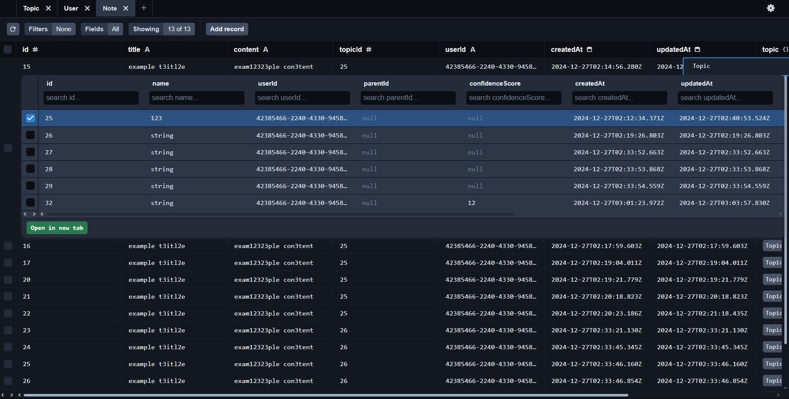
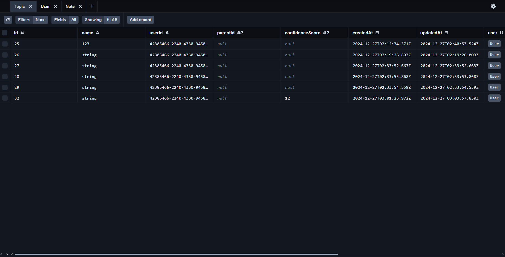
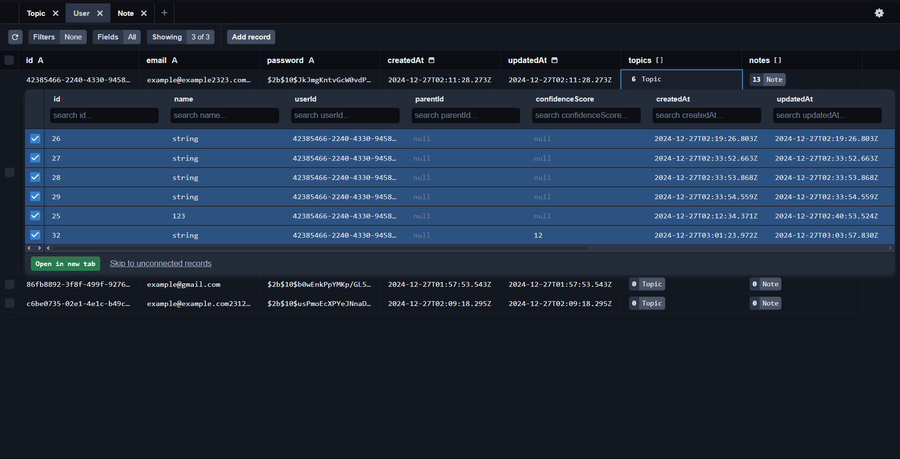
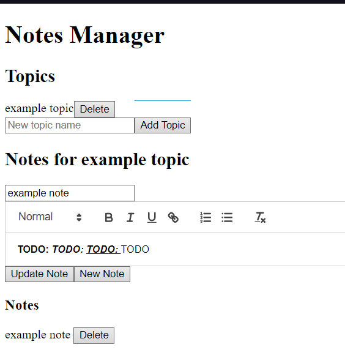
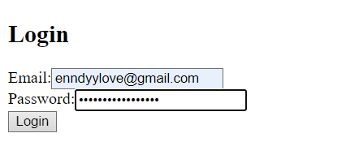
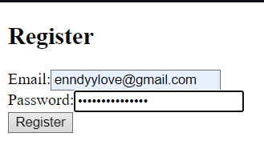

# Nest-React Notes

A full-stack note-taking application built with NestJS (backend) and React (frontend).

## 🚀 Tech Stack

- **Frontend**: React
- **Backend**: NestJS
- **Database**: PostgreSQL (via Docker)
- **Language**: TypeScript (90.5%)

## 📋 Features

- REST API for note management
- Topic and Note type system
- Docker containerized database
- Postman collection for API testing

## 🔗 Client Routes
```
- /         # Main page
- /login    # Login page
- /register # Register page
```


## 🔗 API Endpoints
### Authentication
```
POST /api/auth/login      # User login
POST /api/auth/register   # User registration
```

### Notes

```shellscript
POST   /api/notes      # Create new note
GET    /api/notes      # Get all notes
PUT    /api/notes      # Update note
DELETE /api/notes      # Delete note
PUT    /api/notes/move # Move note to another topic
```

### Topics

```shellscript
POST   /api/topics           # Create new topic
GET    /api/topics           # Get user topics
PUT    /api/topics           # Update topic
DELETE /api/topics           # Delete topic
PUT    /api/topics/confidence # Update topic confidence
```

## 📸 Screenshots
### Databases




### UI (Need to do some styling)




## 🛠️ Installation

1. Clone the repository:
```bash
git clone https://github.com/enndylove/nest-react-notes.git
cd nest-react-notes
```

2. Install dependencies:


```bash
# Install client dependencies
cd client
npm install

# Install server dependencies
cd ../server
npm install
```

3. Set up environment variables:


- Copy `.env.example` to `.env`
- Update the variables according to your setup


4. Start the database:


```bash
docker-compose up -d
```

5. Run the application:


```shellscript
# Start the server (from server directory)
npm start

# Start the client (from client directory)
npm start
```

## 🧪 Testing

The repository includes a Postman collection for testing the REST APIs. Import the collection from:
`Testing REST APIs - Notes.postman_collection.json`

## 📁 Project Structure

```plaintext
nest-react-notes/
├── client/          # React frontend
├── server/          # NestJS backend
└── docker-compose.yml
```

## 📄 License

This project is licensed under the MIT License - see the [LICENSE](https://github.com/enndylove/nest-react-notes/blob/main/LICENSE) file for details.

## 🤝 Contributing

Contributions, issues, and feature requests are welcome! Feel free to check the issues page.

1. Fork the repository
2. Create your feature branch (`git checkout -b feature/amazing-feature`)
3. Commit your changes (`git commit -m 'Add some amazing feature'`)
4. Push to the branch (`git push origin feature/amazing-feature`)
5. Open a Pull Request
---

Built with ❤️ by [enndylove](https://github.com/enndylove)